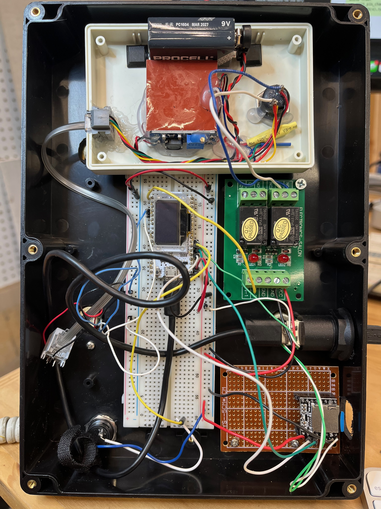

# Retro rotary phone voice box
Converted a family kept vintage rotary phone to play back keepsake messages for my wife's birthday present.

_I will be updating this with pictures and more details as I am continuing to enhance the functionality_

## Parts Used
* [Wifi-kit-32](https://heltec.org/project/wifi-kit-32/) (running Micropython)
* [DFPlayer Mini MP3 Player Module](https://www.amazon.com/gp/product/B08FFLH5XL)
* [ABS Plastic Electronic Enclosure Case](https://www.amazon.com/gp/product/B09N3XS6BD)
* [Power Relay Module](https://www.amazon.com/gp/product/B014F64OGA)
* [TeleRing Telephone Ringer](https://www.ebay.com/itm/201916326756)
* Vintage rotary phone
* Misc: PC boards, pushbutton, wires, USB panel mount, etc

## v1 (currently implemented)
The first version was to get this done in ~2 days.  Here are the features implemented:
* Press a button to start playback process
* Will ring the phone (up to 5 times)
* During the ringing of the telephone, waits for the handset to be lifted off the hook
* Once the handset is lifted, randomly plays 1 of 6 pre-recorded messages

## v2 (in-progress)
Allow the user to place a call (this feature is in-progress)
* Take the handset off the hook
* Play a dialtone (still TODO)
* Allow the person to dial a 3 digit number (partially working)
* Play phone ringing sounds (still TODO)
* Play a determined message (hacked right now, doesn't always work)

## Future wish list
* phone left off the hook plays annoying beeping sounds
* allow for busy signal
* add some type of retro display for the number being dialed
* connect to wifi and serve a web page for controlling the phone
* Add an LED for "there are messages waiting"

## Other thoughts
* The MP3 player is a bit simplistic and auto-indexes the files using a number offset (not sure the ordering yet, need to RTFM)
* The DFPlayer code needs some enhancements to read the files found on the SD Card
* There are some capabilities of the DFPlayer to play audio from a directory (allowing to group like messages)
* Would really like if new messages could be added remotely (i.e. w/o having to manually save to the SD card)

## Photos

