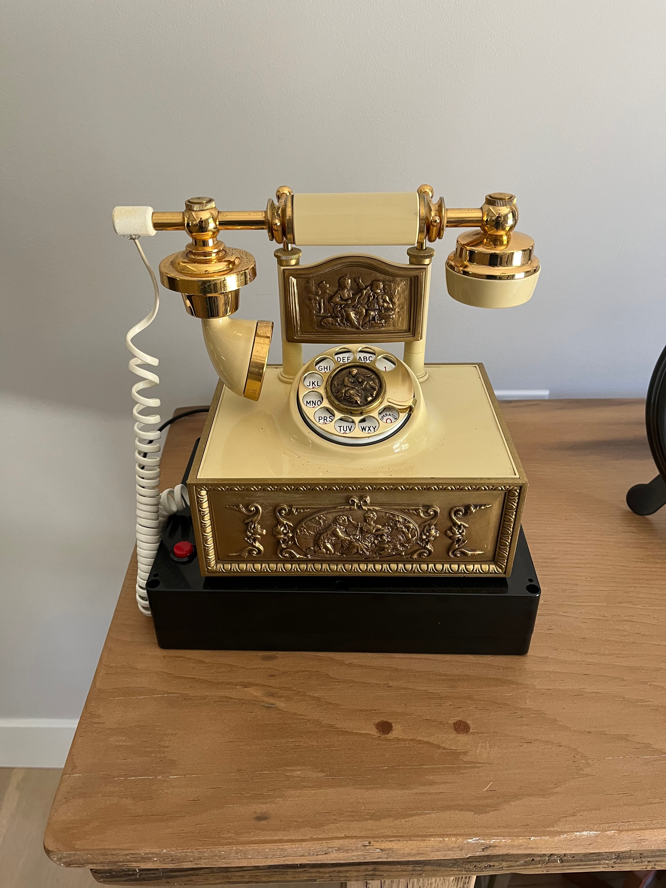

# Retro rotary phone voice box
Converted a family kept vintage rotary phone to play back keepsake messages for my wife's birthday present.

_I will be updating this with pictures and more details as I am continuing to enhance the functionality_

## Parts Used
* [Wifi-kit-32](https://heltec.org/project/wifi-kit-32/) (running MicroPython)
* [DFPlayer Mini MP3 Player Module](https://www.amazon.com/gp/product/B08FFLH5XL)
* [ABS Plastic Electronic Enclosure Case](https://www.amazon.com/gp/product/B09N3XS6BD)
* [Power Relay Module](https://www.amazon.com/gp/product/B014F64OGA)
* [TeleRing Telephone Ringer](https://www.ebay.com/itm/201916326756)
* Vintage rotary phone
* Misc: PC boards, pushbutton, wires, USB panel mount, etc

## v1 (currently implemented)
The first version was to get this done in ~2 days.  Here are the features implemented:
* Press a button to start playback process
* Will ring the phone (up to 5 times)
* During the ringing of the telephone, waits for the handset to be lifted off the hook
* Once the handset is lifted, randomly plays 1 of 6 pre-recorded messages

## v2 (in-progress)
Allow the user to place a call (this feature is in-progress)
* Take the handset off the hook
* Play a dialtone (still TODO)
* Allow the person to dial a 3 digit number (partially working)
* Play phone ringing sounds (still TODO)
* Play a determined message (hacked right now, doesn't always work)

## Future wish list
* phone left off the hook plays annoying beeping sounds
* allow for busy signal
* add some type of retro display for the number being dialed
* connect to wifi and serve a web page for controlling the phone
* Add an LED for "there are messages waiting"

## Other thoughts
* The MP3 player is a bit simplistic and auto-indexes the files using a number offset (not sure the ordering yet, need to RTFM)
* The DFPlayer code needs some enhancements to read the files found on the SD Card
* There are some capabilities of the DFPlayer to play audio from a directory (allowing to group like messages)
* Would really like if new messages could be added remotely (i.e. w/o having to manually save to the SD card)

## Takeaways / Lessons Learned
### PyCharm CE and the MicroPython Plugin
Using PyCharm CE along with the MicroPython Plugin makes the productivity of programming and debugging the code much easier.  

The problem developing/debugging MicroPython happens when I would have different terminal windows open, one for uploading the source and the other for debugging with the REPL.  If the REPL is connected, then uploading the source will fail (as the serial port is already in use).  Also, trying to disconnect from the serial port via the `screen` command is a few keystrokes that I don't always remember, then I end up background the `screen` session.  

The [MicroPython plugin](https://github.com/JetBrains/intellij-micropython) for PyCharm makes uploading your source files and connecting to the REPL to be quick and easy, automatically handing the disconnecting needed to not get in each other's way.

### Call a `main()` function from the `if __name__ == "__main__":` body
When using MicroPython, and connecting to the serial port from PyCharm, it will immediate perform a Keyboard Interrupt and put you at the MicroPython REPL.
From here, you can simply call the main function yourself by typing in `main()` and watch your debugging output.

The following structure has worked well in this project:
```
def init():
    # do init stuff here
    pass

def deinit():
    # do de-init stuff here
    pass

def main():
    init()
    try:
        # main program here
        pass
    except KeyboardInterrupt:
        # prevents an unnecessary error message when connecting to the REPL from PyCharm
        pass
    finally:
        deinit()

if __name__ == '__main__':
    main()
```

### Use the built-in `Pin.PULL_UP` and `Pin.PULL_DOWN` instead of adding a resistor
When connecting to a pushbutton (or something that can have an open/floating connection, e.g. rotary pulse, hook, etc) you would normally need to add your own pull-up or pull-down resister.  Using the built-in [`Pin.PULL_UP` and `Pin.PULL_DOWN`](https://docs.micropython.org/en/latest/library/machine.Pin.html#class-pin-control-i-o-pins) makes the project much more simple.

### Use `irq` instead of polling for I/O changes
[`irq`](https://docs.micropython.org/en/latest/library/machine.Pin.html?highlight=irq#machine.Pin.irq) makes "watching" for I/O changes much easier in the application.  Depending on the MicroPython hardware being used, there are restrictions to which pin can be used for `irq`.  

Read the [Writing interrupt handlers](https://docs.micropython.org/en/latest/reference/isr_rules.html) documentation for recommendations for your `irq` callbacks.  _After reading this myself, I need to go back and fix my irq code._

## Photos


